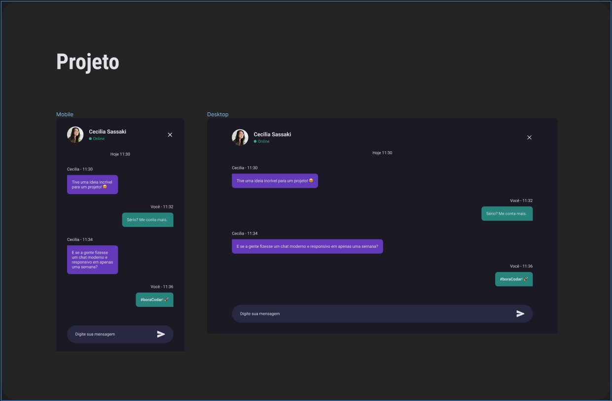

  

  

## 🖥️ Projeto
Esse é um projeto web no desafio do hora de codar, onde feito uma pagina de chat de conversas, aplicando a responsividade, ou seja, ajustando o conteúdo para aparelhos mobile e desktop.

## 🚀 Tecnologias
Esse projeto foi desenvolvido durante o curos de Explore da Rocketsat com as seguintes tecnologias:

- HTML
- CSS
- JAVA SCRIPT
- GIT E GITHUB
- FIGMA

## 🏷️layout
Você pode visualizar o layout do projeto através 
[desse link](https://www.figma.com/file/feASeLOZzFLWUiBhIwhN48/Chat-%E2%80%A2-Desafio-04-(Community)?node-id=205%3A149&mode=dev).
É necessario ter uma conta no [Figma](https://www.figma.com).